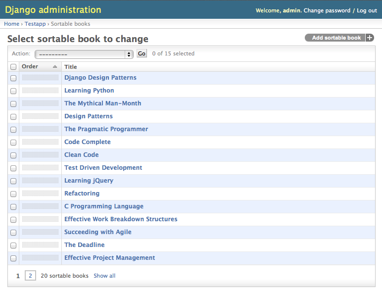

django-admin-sortable2
======================

Another generic drag-and-drop ordering for sorting objects in the list view of the Django admin
interface. It is a rewrite of https://github.com/iambrandontaylor/django-admin-sortable
using another approach.

This plugin offers a simple mixin class which augments the functionality of an existing admin
interface. It thus makes it very easy to integrate with existing models and their model admin 
interfaces.

The admin interface slightly modifies the list view of a sortable model. Next to the action checkbox,
a draggable area is added to each entry line. The user than may click on any item and vertically drag
that item to a new position.

If one or more items shall be moved to another page, this can easily been done by selecting them though the
action checkbox, followed by using a predefined action from the pull down menu on the top of the list view.

Build status
------------
.. image:: https://travis-ci.org/jrief/django-admin-sortable2.png
   :target: https://travis-ci.org/jrief/django-admin-sortable2

Installation
------------
From PyPI::

  pip install django-admin-sortable2

From github::

  pip install -e git+https://github.com/jrief/django-admin-sortable2#egg=django_admin_sortable2

Add ``adminsortable`` to your INSTALLED_APPS.

Integrate your models
---------------------
Each database model you want to sort, requires a position value in its model description. Rather
than defining a base class, which contains such a positional value in a hard coded field, this
plugin lets reuse existing fields or attempts to delegate this responsibility to the programmer.
Therefore this plugin can be applied in situations, where your model is derived from an existing
abstract model, which already contains any kind of position value. The only requirement for this 
plugin is, that this position value is specified as the default ordering.

If you specify a database model, make sure it contains an integer field to store the position value.
This field must be set as the default ordering. Any existing model can be turned into a sortable
model by adding two lines of code to the file ``models.py``::

  from django.db import models
  
  class MyModel(models.Model):
      ... other fields ...
      position = models.PositiveIntegerField(db_index=True, blank=False, null=False)
      
      class Meta(object):
          ordering = ['position']

You are free to use any name for the field named ``position`` here. Just make sure, that it is the
first one in the list ``ordering`` in the class ``Meta``.

In ``admin.py``, add a mixin class to augment the functionality for sorting::

  from django.contrib import admin
  from adminsortable.admin import SortableAdminMixin
  from myapp.models import MyModel
  
  class MyModelAdmin(SortableAdminMixin, admin.ModelAdmin):
      pass
  admin.site.register(MyModel, MyModelAdmin)

that's it! The list view of the model admin interface now adds a column with a sensitive area. By
clicking on that area, the user can move that row up or down. If he wants to move it to another
page, he can do that as a bulk operation, using the admin actions.

Initial data
------------
In case you just changed your model to contain an additional field named, say ``order``, which does
not yet contain any values, then you may set initial ordering values by typing this code snipped
into your Django managing shell::

  val = 0
  for obj in MySortableModel.objects.all():
      val += 1
      obj.order = val
      obj.save()

A note to MySQL users
.....................
MySQL has a feature (or bug?) which requires to use the ``ORDER BY`` clause in bulk updates on
unique fields. See https://code.djangoproject.com/ticket/20708 for details. Therefore do set
``unique=False`` on your position field.

TODO
----
 * Tabular and stacked inlines.

Why another plugin?
-------------------
All available plugins which add functionality to make list views for the Django admin interface
sortable, offer a base class to be used instead of ``models.Model``. This abstract base class then
contains a hard coded position field, additional methods and meta directives. The problem with this
approach is twofold. First, an IS-A relationship is abused to augment the functionality of a class.
This is bad OOP practice. A base class shall only be used to reflect a real IS-A relation which
specializes this base class. For instance: A mammal **is an** animal, a primate **is a** mammal,
homo sapiens **is a** primate, etc.

But a sortable model **is not an** unsortable model. Making a model sortable, means to augment its
functionality. This in OOP design does not qualify for an IS-A relationship.

Fortunately, Python makes it very easy, to distinguish between IS-A relationships and augmenting
functionality. The latter cases are handled by mixin classes. They offer additional functionality
for a class, without deriving from the base class.

Also consider the case, when someone wants to augment some other functionality of a model class.
If he also derives from ``models.Model``, he would create another abstract intermediate class.
Someone who wants to use both functional augmentations, now is in trouble. Or he has to choose
between one of the two, or if he derives from both, his model class inherits the base class
``models.Model`` twice.

By using a mixin class rather than deriving from a special abstract base class, these problems
can be avoided!

Related projects
================
 * https://github.com/iambrandontaylor/django-admin-sortable
 * http://djangosnippets.org/snippets/2057/
 * http://djangosnippets.org/snippets/2306/
 * https://github.com/mtigas/django-orderable
 * http://catherinetenajeros.blogspot.co.at/2013/03/sort-using-drag-and-drop.html

Release history
===============
 * 0.0.1 first working release.
 * 0.1.0 first version published on PyPI.
