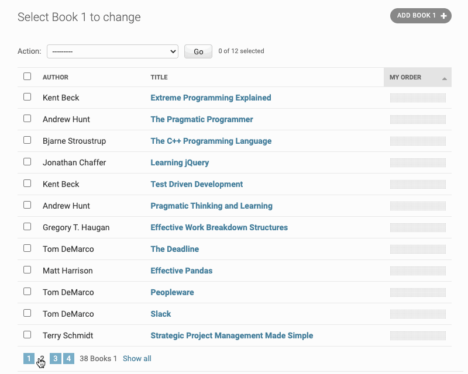

.. adminsortable2 documentation master file

======================
django-admin-sortable2
======================

is a generic drag-and-drop ordering package to sort objects in the list- and detail inline-views
of the Django admin interface. This package offers simple mixin classes which enriches the
functionality of *any* existing class derived from ``admin.ModelAdmin``, ``admin.StackedInline``
or ``admin.TabularInline``. It thus makes it very easy to integrate with existing models and their
model admin interfaces.

Project home: https://github.com/jrief/django-admin-sortable2

Features
========

Must not inherit from any special Model base class
--------------------------------------------------

Other plugins offering functionality to make list views for the Django admin interface sortable,
offer a base class to be used instead of ``models.Model``. This class then contains a hard coded
position field, additional methods, and meta directives.

By using a mixin to enrich an existing class with sorting, we can integrate this Django-app into
existing projects with minimal modification to the code base.

Intuitive List View
-------------------

By adding a draggable area into one of the columns of the Django admin's list view, sorting rows
becomes very intuitive. Alternatively, rows can be selected using the checkbox and sorted as a
group.

If rows have to be sorted accross pages, they can be selected using the checkbox and moved to any
other page using an `Admin action`_.

.. _Admin action: https://docs.djangoproject.com/en/stable/ref/contrib/admin/actions/

Support for Stacked- and Tabular Inlines
----------------------------------------

If a Django admin view uses `InlineModelAdmin objects`_, and the related model provides an
ordering field, then those inline models can be sorted in the detail view.

.. _InlineModelAdmin objects: https://docs.djangoproject.com/en/stable/ref/contrib/admin/#inlinemodeladmin-objects

Contents:
=========
.. toctree::

  installation
  usage
  contributing

License
=======

Copyright Jacob Rief and contributors.

Licensed under the terms of the MIT license.

Some Related projects
=====================

* https://github.com/jazzband/django-admin-sortable
* https://github.com/mtigas/django-orderable
* https://djangosnippets.org/snippets/2057/
* https://djangosnippets.org/snippets/2306/
