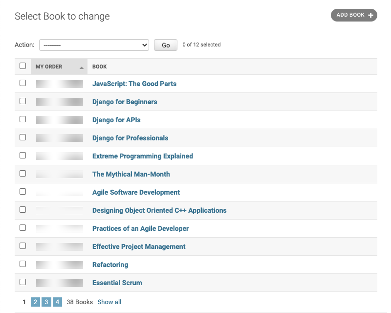
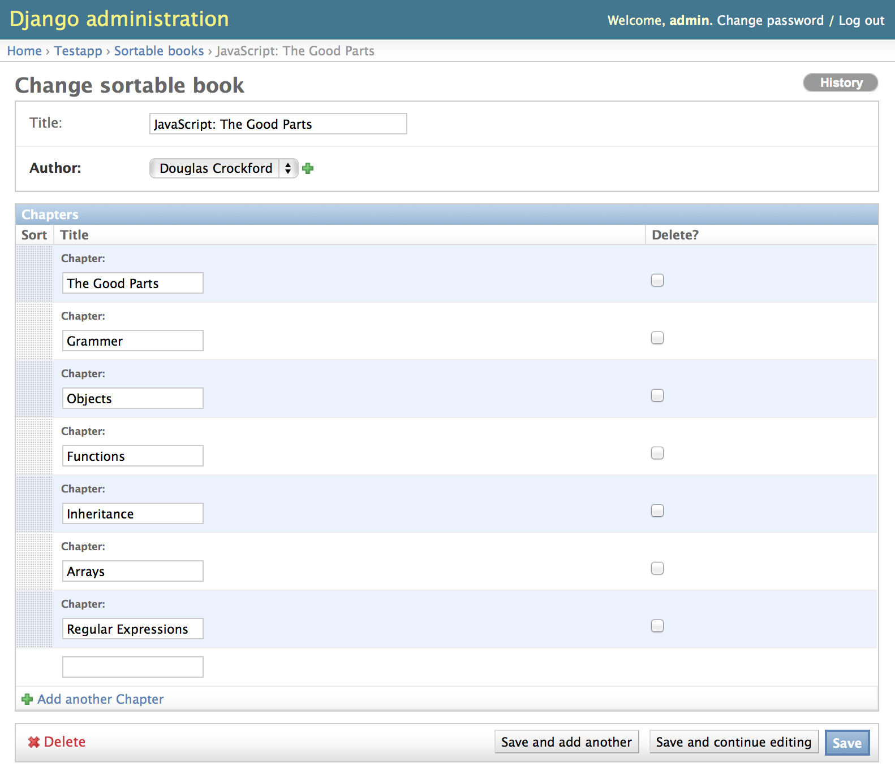

.. _usage:

====================
Using Admin Sortable
====================

This Django module offers three mixin classes to be added to the existing classes of your model
admin:

* ``admin.ModelAdmin``
* ``admin.StackedInline``
* ``admin.TabularInline``

They slightly modify the admin views of a sortable model. There is no need to derive your model
class from a special base model class. You can use your existing ordered field, just as you always
did, or add a new one with any name you like, if needed.

Integrate your models
=====================

Each database model which shall be sortable, requires a position value in its model description.
Rather than defining a base class, which contains such a positional value in a hard coded field,
this module lets you reuse existing sort fields or define a new field for the sort value.

Therefore this module can be applied in situations where your model is derived from an existing
abstract model which already contains any kind of position value. The only requirement for this
module is, that this position value be specified as the primary field used for sorting. This
in Django is declared through the model's Meta class. An example ``models.py``:

.. code:: python

	class SortableBook(models.Model):
	    title = models.CharField('Title', null=True, blank=True, max_length=255)
	    my_order = models.PositiveIntegerField(default=0, blank=False, null=False)
	
	    class Meta(object):
	        ordering = ['my_order']

Here the ordering field is named ``my_order``, but you may choose any other name. There are three
constraints:

* ``my_order`` is the first field in the ``ordering`` tuple of the model's Meta class.
* ``my_order``'s default value must be 0. The JavaScript which performs the sorting is 1-indexed,
	so this will not interfere with the order of your items, even if you're already using 0-indexed
	ordering fields.
* The ``my_order`` field must be editable, so make sure that you **do not** add ``editable=False``
	to it.

The field used to store the ordering position may be any kind of numeric model field offered by
Django. Use one of these models fields:

* ``models.BigIntegerField``
* ``models.IntegerField``
* ``models.PositiveIntegerField`` (recommended)
* ``models.PositiveSmallIntegerField`` (recommended for small sets)
* ``models.SmallIntegerField``

Additionally you may use ``models.DecimalField`` or ``models.FloatField``, but these model fields
are not recommended.

.. warning:: Do not make this field unique! See below why.

In Django's Admin, make the list view sortable
==============================================

Next to the action checkbox, a draggable area is added to each entry line. The user than may click
on any item and vertically drag that item to a new position.

Sortable List View
------------------

If one or more items shall be moved to another page, this can easily been done by selecting them
though the action checkbox. Then the user shall click on a predefined action from the pull down
menu on the top of the list view.

Integrate into a list view
..........................

In ``admin.py``, add a mixin class to augment the functionality for sorting (be sure to put the
mixin class before model.ModelAdmin):

.. code:: python

	from django.contrib import admin
	from adminsortable2.admin import SortableAdminMixin
	from models import MyModel

	@admin.register(MyModel)
	class MyModelAdmin(SortableAdminMixin, admin.ModelAdmin):
	    pass

That's it! The list view of the model admin interface now adds a column with a draggable area.
By clicking on that area, the user can move that row up or down. If he wants to move it to another
page, he can do that as a bulk operation, using the admin actions.

By default the draggable area is positioned on the first column. If it shall be placed somewhere else,
add the ordering field name explicitly to the attribute ``list_display``.

Overriding change list page
...........................

To add for example a custom tool to the change list view, copy ``contrib/admin/templates/admin/change_list.html``
to either ``templates/admin/my_app/`` or ``templates/admin/my_app/page/`` directory of your project and make sure
you are extending from the right template:

.. code:: html

    

    
        {{ block.super }}
        <li>
            <a href="mylink/">My Link</a>
        </li>
    

Make a stacked or tabular inline view sortable
==============================================

The interface for a sortable stacked inline view looks exactly the same. If you click on an stacked
inline's field title, this whole inline form can be moved up and down.

The interface for a sortable tabular inline view adds a sensitive area to each draggable row. These
rows then can be moved up and down.

Sortable Tabular Inlines
------------------------

After moving a tabular or stacked inline, save the model form to persist
its sorting order.

Integrate into a detail view
............................

.. code:: python

	from django.contrib import admin
	from adminsortable2.admin import SortableInlineAdminMixin
	from models import MySubModel, MyModel
	
	class MySubModelInline(SortableInlineAdminMixin, admin.TabularInline):  # or admin.StackedInline
	    model = MySubModel

	@admin.register(MyModel)
	class MyModelAdmin(admin.ModelAdmin):
	    inlines = (MySubModelInline,)

.. note:: Remember to also set the list ``ordering`` in the ``Meta`` class of ``MySubModel``.

.. warning:: Tabular inlines with help text expect ``admin/img/icon_unknown.svg`` to be in the staticfiles path. \
	Prior to Django 1.9, you'll need to manually add this icon or patch the template to remove it.

Sortable Many to Many Relations with Sortable Tabular Inlines
=================================================================
Sortable many to many relations can be achieved by creating a model to act as a juction table and adding an ordering field. This model can be specified on the ``models.ManyToManyField`` ``through`` parameter that tells the Django ORM to use your juction table instead of creating a default one. Otherwise, the process is conceptually similar to the above examples.

For example if you wished to have buttons added to control panel able to be sorted into order via the Django Admin interface you could do the following. A key feature of this approach is the ability for the same button to be used on more than one panel.

Specify a junction model and assign it to the ManyToManyField
................................................................

``models.py``

.. code:: python
	from django.db.import models

	class Button(models.Model):
		"""A button"""
		name = models.CharField(max_length=64)
		button_text = models.CharField(max_length=64)

	class Panel(models.Model):
		"""A Panel of Buttons - this represents a control panel."""
		name = models.CharField(max_length=64)
		buttons = models.ManyToManyField(Button, through='PanelButtons')

	class PanelButtons(models.Model):
		"""This is a junction table model that also stores the button order for a panel."""
		panel = models.ForeignKey(Panel)
		button = models.ForeignKey(Button)
		button_order = models.PositiveIntegerField(default=0)
		class Meta:
			ordering = ('button_order',)

Setup the Tabular Inlines to enable Buttons to be sorted in Django Admin
..........................................................................
``admin.py``

.. code:: python
	from django.contrib import admin
	from adminsortable2.admin import SortableInlineAdminMixin
	from models import Panel

	class ButtonTabularInline(SortableInlineAdminMixin, admin.TabularInline):
		model = Panel.buttons.through # Note: we do not use the Button model but rather the juction table model specified on Panel.

	@admin.register(Panel)
	class PanelAdmin(admin.ModelAdmin)
		inlines = (ButtonTabularInline,)

Initial data
============

In case you just changed your model to contain an additional sorting
field (e.g. ``my_order``), which does not yet contain any values, then
you **must** set initial ordering values.

**django-admin-sortable2** is shipping with a management command which can be used to prepopulate
the ordering field:

.. code:: python

	shell> ./manage.py reorder my_app.ModelOne [my_app.ModelTwo ...]

If you prefer to do a one-time database migration, just after having added the ordering field 
to the model, then create a datamigration.

..code:: python

	shell> ./manage.py makemigrations myapp

this creates **non** empty migration named something like ``migrations/0123_auto_20160208_054.py``.

Edit the file and change it into a data migration:

.. code:: python

	def reorder(apps, schema_editor):
	    MyModel = apps.get_model("myapp", "MyModel")
	    order = 0
	    for item in MyModel.objects.all():
	        order += 1
	        item.my_order = order
	        item.save()
	

then add to operations list, after migrations. Add ``migrations.RunPython(reorder)`` to the list
of operations:

.. code:: python

	class Migration(migrations.Migration):
	    operations = [
	        ....
	        migrations.RunPython(reorder),
	    ]

then apply the changes to the database using:

.. code:: bash

	shell> ./manage.py migrate myapp

.. note:: If you omit to prepopulate the ordering field with unique values, after adding this field
		to an existing model, then attempting to reorder field manually will fail.

Note on unique indices on the position field
============================================

From a design consideration, one might be tempted to add a unique index on the ordering field. But
in practice this has serious drawbacks:

MySQL has a feature (or bug?) which requires to use the ``ORDER BY`` clause in bulk updates on
unique fields.

SQLite has the same bug which is even worse, because it does neither update all the fields in one
transaction, nor does it allow to use the ``ORDER BY`` clause in bulk updates.

Only PostgreSQL does it "right" in the sense, that it updates all fields in one transaction and
afterwards rebuilds the unique index. Here one can not use the ``ORDER BY`` clause during updates,
which from the point of view for SQL semantics, is senseless anyway.

See https://code.djangoproject.com/ticket/20708 for details.

Therefore I strongly advise against setting ``unique=True`` on the position field, unless you want
unportable code, which only works with Postgres databases.
