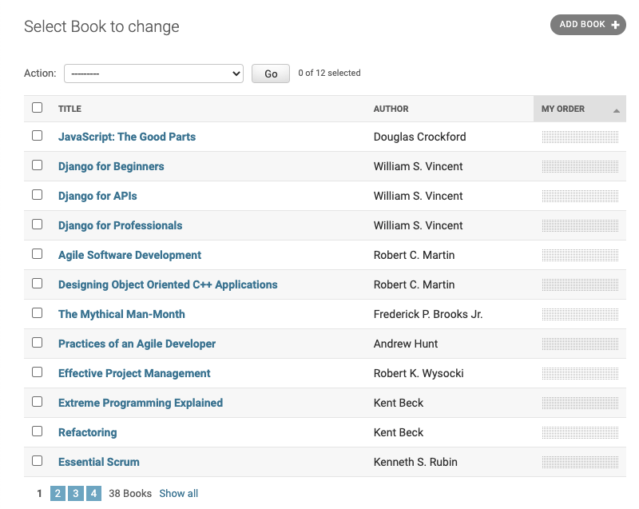
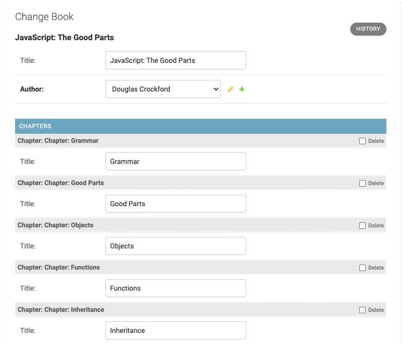
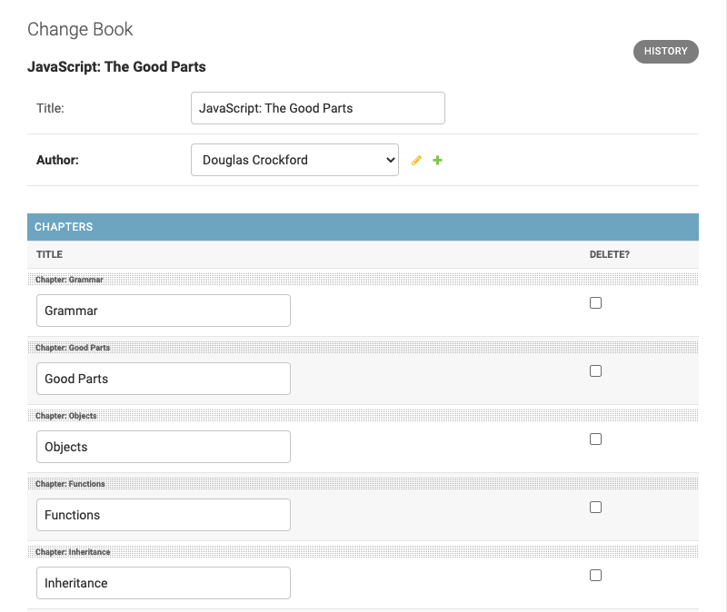

.. _usage:

====================
Using Admin Sortable
====================

This library tries to not interfere with existing Django models. Instead it adopts any class
inheriting from :class:`~django.db.models.Model`, provided it offers a field for sorting.

Prepare the Model Classes
=========================

Each database model which shall be sortable, requires a position value in its model description.
Rather than defining a base class, which contains such a positional value in a hard coded field,
this library lets you reuse existing sort fields or define a new field for the sort value.

Therefore this module can be applied in situations where your model inherits from an existing
abstract model which already contains any kind of position value. The only requirement is, that this
position value be specified as the primary field used for sorting. This in Django is declared
through the model's ``Meta`` class. Here's an example ``models.py``:

.. code:: python

	class SortableBook(models.Model):
	    title = models.CharField(
	        "Title",
	        max_length=255,
	    )

	    my_order = models.PositiveIntegerField(
	        default=0,
	        blank=False,
	        null=False,
	    )

	    class Meta:
	        ordering = ['my_order']

Here the ordering field is named ``my_order``, but any valid Python variable name will work. There
are some constraints though:

* ``my_order`` is the first field in the ``ordering`` list (or tuple) of the model's ``Meta`` class.
  Alternatively the ordering can be specified inside the class inheriting from ``ModelAdmin``
  registered for this this model.
* ``my_order`` shall be indexed for performance reasons, so add the attribute ``db_index=True`` to
  the field's definition.
* ``my_order``'s default value must be 0. The JavaScript which performs the sorting is 1-indexed,
  so this will not interfere with the order of the items, even if they are already using 0-indexed
  ordering fields.
* The ``my_order`` field must be editable, so make sure that it **does not** contain attribute
  ``editable=False``.

The field used to store the ordering position may be any kind of numeric model field offered by
Django. Use one of these models fields:

* :class:`~django.db.models.BigIntegerField`
* :class:`~django.db.models.IntegerField`
* :class:`~django.db.models.PositiveIntegerField` (recommended)
* :class:`~django.db.models.PositiveSmallIntegerField` (recommended for small sets)
* :class:`~django.db.models.SmallIntegerField`

In addition to the recommended fields, :class:`~django.db.models.DecimalField` or
:class:`~django.db.models.FloatField` may work, but haven't been tested.

.. warning:: Do not make this field unique! See below why.

In Django's Admin, make the List View sortable
==============================================

If a models contains an ordering field, all we need to make the Django's Admin List View sortable,
is adding the mixin class :class:`adminsortable2.admin.SortableAdminMixin`. By inheriting from this
mixin class together with :class:`~django.contrib.admin.ModelAdmin`, we get a list view which
without any further configuration, owns the functionality to sort its items.

Using the above ``SortableBook`` model, we can register a default admin interface using

.. code-block:: python

	from django.contrib import admin
	from adminsortable2.admin import SortableAdminMixin

	from myapp.models import SortableBook

	@admin.register(SortableBook)
	class SortableBookAdmin(SortableAdminMixin, admin.ModelAdmin):
	    pass

This creates a list view with a drag area for each item. By dragging and dropping those items, one
can resort the items in the database.

.. image:: _static/list-view.png
  :width: 800
  :alt: Sortable List View

It also is possible to move more than one item at a time. Simply select them using the action
checkboxes on the left hand side and move all selected row to a new position.

If the list view is subdivided into more than one page, and items shall be moved to another page,
simply select them using the action checkboxes on the left hand side and from the pull down menu
named **Action**, choose onto which page the selected items shall be moved.

.. note:: In the list view, the ordering field is updated immediatly inside the database.

In case the model does not specify a default ordering field in its ``Meta`` class, it also is
possible to specify that field inside the ``ModelAdmin`` class. The above definition then can be
rewritten as:

.. code-block:: python

	@admin.register(SortableBook)
	class SortableBookAdmin(SortableAdminMixin, admin.ModelAdmin):
	    ordering = ['my_order']

By default, the draggable area is positioned on the first column. If it shall be placed somewhere
else, add ``list_display`` to ``SortableBookAdmin`` containing the field names of the columns to be
rendered in the model's list view. Redefining the above class as:

.. code-block:: python

	@admin.register(SortableBook)
	class SortableBookAdmin(SortableAdminMixin, admin.ModelAdmin):
	        list_display = ['title', 'author', 'my_order']

will render the list view as:

In Django's Admin Detail View, make Stacked- and Tabular-Inlines sortable
=========================================================================

If a model on the same page has a parent model, these are called inlines. Suppose we have a sortable
model for chapters and want to edit the chapter together with the book's title using the same
editor, then Django admin offers the classes :class:`~django.contrib.admin.StackedInline` and
:class:`~django.contrib.admin.TabularInline`. To make these inline admin interfaces sortable,
we simple use the mixin class :class:`adminsortable2.admin.SortableAdminMixin`.

Example:

.. code-block:: python

	...
	from adminsortable2.admin import SortableStackedInline

	from myapp.models import Chapter

	class ChapterStackedInline(SortableStackedInline):
	    model = Chapter

	@admin.register(SortableBook)
	class SortableBookAdmin(SortableAdminMixin, admin.ModelAdmin):
	    ...
	    inlines = [ChapterStackedInline]

In case model ``Chapter`` shall be sortable, but model ``Book`` doesn't have to, rewrite the above
class as:

.. code-block:: python

	...
	from adminsortable2.admin import SortableAdminBase

	@admin.register(Book)
	class SortableBookAdmin(SortableAdminBase, admin.ModelAdmin):
	    ...
	    inlines = [ChapterStackedInline]

For stacked inlines, the editor for the book's detail view looks like:

.. note:: Since version 2.1, two buttons have been added to the draggable area above each inline
	form. They serve to move that edited item to the begin or end of the list of inlines.

If we instead want to use the tabluar inline class, then modify the code from above to

.. code-block:: python

	...
	from adminsortable2.admin import SortableTabularInline

	from myapp.models import Chapter

	class ChapterTabularInline(SortableTabularInline):
	    model = Chapter

	@admin.register(SortableBook)
	class SortableBookAdmin(SortableAdminMixin, admin.ModelAdmin):
	    ...
	    inlines = [ChapterTabularInline]

the editor for the book's detail view then looks like:

.. note:: When sorting items in the stacked or tabular inline view, these changes are not updated
	immediatly inside the database. Instead the parent model must explicitly be saved.

Sortable Many-to-Many Relations with Sortable Inlines
=====================================================
Sortable many to many relations can be achieved by creating a model to act as a juction table and
adding an ordering field. This model can be specified on the ``models.ManyToManyField`` ``through``
parameter that tells the Django ORM to use your juction table instead of creating a default one.
Otherwise, the process is conceptually similar to the above examples.

For example if you wished to have buttons added to control panel able to be sorted into order via
the Django Admin interface you could do the following. A key feature of this approach is the ability
for the same button to be used on more than one panel.

Specify a junction model and assign it to the ManyToManyField
-------------------------------------------------------------

``models.py``

.. code:: python

	from django.db.import models

	class Button(models.Model):
	    """A button"""
	    name = models.CharField(max_length=64)
	    button_text = models.CharField(max_length=64)

	class Panel(models.Model):
	    """A Panel of Buttons - this represents a control panel."""
	    name = models.CharField(max_length=64)
	    buttons = models.ManyToManyField(Button, through='PanelButtons')

	class PanelButtons(models.Model):
	    """This is a junction table model that also stores the button order for a panel."""
	    panel = models.ForeignKey(Panel)
	    button = models.ForeignKey(Button)
	    button_order = models.PositiveIntegerField(default=0)

	    class Meta:
	        ordering = ['button_order']

Setup the Tabular Inlines to enable Buttons to be sorted in Django Admin
------------------------------------------------------------------------

``admin.py``

.. code:: python

	from django.contrib import admin
	from adminsortable2.admin import SortableInlineAdminMixin, SortableAdminBase
	from models import Panel

	class ButtonTabularInline(SortableInlineAdminMixin, admin.TabularInline):
	    # We don't use the Button model but rather the juction model specified on Panel.
	    model = Panel.buttons.through

	@admin.register(Panel)
	class PanelAdmin(SortableAdminBase, admin.ModelAdmin):
	    inlines = (ButtonTabularInline,)

Initial data
============

In case you just changed your model to contain an additional sorting field (e.g. ``my_order``),
which does not yet contain any values, then you **must** set initial ordering values.

**django-admin-sortable2** is shipped with a management command which can be used to prepopulate
the ordering field:

.. code:: python

	shell> ./manage.py reorder my_app.ModelOne [my_app.ModelTwo ...]

If you prefer to do a one-time database migration, just after having added the ordering field
to the model, then create a datamigration.

.. code:: python

	shell> ./manage.py makemigrations myapp

this creates **non** empty migration named something like ``migrations/0123_auto_20220331_001.py``.

Edit the file and add a data migration:

.. code:: python

	def reorder(apps, schema_editor):
	    MyModel = apps.get_model("myapp", "MyModel")
	    for order, item in enumerate(MyModel.objects.all(), 1):
	        item.my_order = order
	        item.save(update_fields=['my_order'])

Now add ``migrations.RunPython(reorder)`` to the list of operations:

.. code:: python

	class Migration(migrations.Migration):
	    operations = [
	        ....
	        migrations.RunPython(reorder, reverse_code=migrations.RunPython.noop),
	    ]

then apply the changes to the database using:

.. code:: bash

	shell> ./manage.py migrate myapp

.. note:: If you omit to prepopulate the ordering field with unique values, after adding that field
	to an existing model, then attempting to reorder items in the admin interface will fail.

Note on unique indices on the ordering field
============================================

From a design consideration, one might be tempted to add a unique index on the ordering field. But
in practice this has serious drawbacks:

MySQL has a feature (or bug?) which requires to use the ``ORDER BY`` clause in bulk updates on
unique fields.

SQLite has the same bug which is even worse, because it does neither update all the fields in one
transaction, nor does it allow to use the ``ORDER BY`` clause in bulk updates.

Only PostgreSQL does it "right" in the sense, that it updates all fields in one transaction and
afterwards rebuilds the unique index. Here one can not use the ``ORDER BY`` clause during updates,
which from the point of view for SQL semantics, is senseless anyway.

See https://code.djangoproject.com/ticket/20708 for details.

Therefore I strongly advise against setting ``unique=True`` on the position field, unless you want
unportable code, which only works with Postgres databases.

Usage in combination with other libraries
=========================================

When combining **django-admin-sortable2**'s admin classes with those of other libraries, inheritance order is important.

django-solo
-----------

When using an admin class that inherits from `django-solo <https://github.com/lazybird/django-solo>`_'s ``SingletonModelAdmin`` class, the ``SortableAdminBase`` class must be specified first.

This first example is incorrect, and will cause an exception of ``TypeError: getattr(): attribute name must be string`` when saving inlines within the admin class.

.. code:: python

	@admin.register(models.Homepage)
	class HomepageAdmin(SingletonModelAdmin, SortableAdminBase):
		# ...

The correct inheritance order is:

.. code:: python

	@admin.register(models.Homepage)
	class HomepageAdmin(SortableAdminBase, SingletonModelAdmin):
		# ...

Contributions of other examples to this section are welcome.
